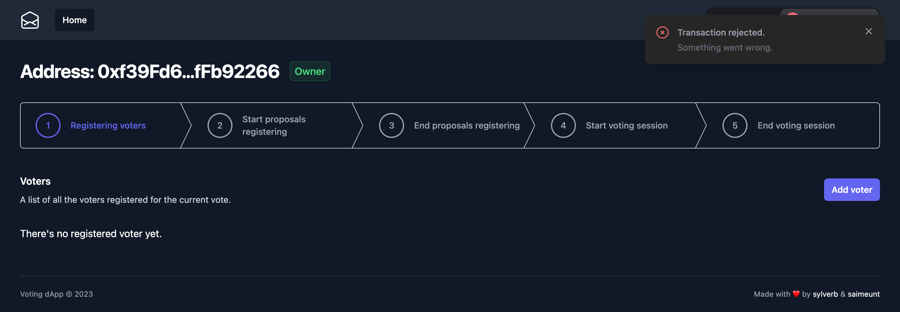

# Voting dApp

## Run in dev

```
pnpm hardhat:node
pnpm hardhat:deploy:localhost
pnpm dev
```

## Test

`pnpm hardhat:test`

## Coverage

`pnpm hardhat:coverage`

| File       | % Stmts | % Branch | % Funcs | % Lines | Uncovered Lines |
| ---------- | ------- | -------- | ------- | ------- | --------------- |
| Voting.sol | 100     | 100      | 100     | 100     |                 |
| All files  | 100     | 100      | 100     | 100     |                 |

## Deploy contract

`pnpm hardhat:deploy:sepolia`

Contract is deployed on sepolia test network at:

https://sepolia.etherscan.io/address/0x03b9A2c6A31BB5cda0e9042761820B611c1aF1EF

## Deploy dApp

`git push`

dApp is deployed on Vercel at:

https://voting-dapp-sepolia.vercel.app/

## Demo

A demo of the voting process using this dApp is available here:

https://www.loom.com/share/d570a2a8353c42bcaaf5f3d8853a0dd8?sid=60028c6e-34fc-4e57-bb22-2fcc39627c22



A screenshot of the owner interface showing a failed transaction notification.
